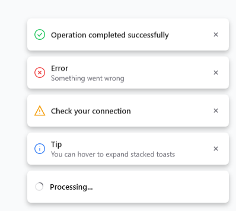

# WPF Toaster

I needed a clean toast system for WPF that follows MVVM properly and doesn't feel like an afterthought. Most existing solutions either break the pattern or look dated, so I built this one from scratch. It handles stacking, animations, async promise toasts, and theming, all configurable from XAML. Drop it into any project and it just works.



## Features

- Fully MVVM-compliant architecture with no code-behind logic
- Adaptive UI that integrates cleanly into any WPF application
- Sonner-style stacking with hover-to-expand interaction
- Smooth entrance, exit, and reorder animations
- Async promise toasts with loading spinner and automatic resolution
- Six configurable positions via XAML
- Themeable through resource dictionaries

## Setup

1. Add the `Essentials`, `ViewModels`, `Views`, `Converters`, `Behaviors`, and `Utilities` folders to your project.
2. Merge `Resources/Theme.xaml` and `Resources/Styles.xaml` into your `App.xaml` resource dictionaries.
3. Wrap your root content in `ToastHost`:

```xml
<views:ToastHost Position="BottomRight">
    <!-- Your application content -->
</views:ToastHost>
```

## Usage

```csharp
// Simple toast
Toaster.Toast("File saved", ToastStatus.Success);

// Toast with title and description
Toaster.Toast("Error", "Connection timed out", ToastStatus.Error);

// Promise toast (shows spinner, resolves to success or error)
await Toaster.Promise(
    async () => await SomeLongRunningTask(),
    loading: "Processing...",
    success: "Done!",
    error: "Something went wrong"
);

// Generic promise toast with result
var result = await Toaster.Promise(
    async () => await FetchDataAsync(),
    loading: "Fetching...",
    success: data => $"Loaded {data.Name}",
    error: "Failed to fetch"
);
```

## Positions

`TopLeft` · `TopCenter` · `TopRight` · `BottomLeft` · `BottomCenter` · `BottomRight`

## Theming

Edit `Resources/Theme.xaml` to adjust colors. Toast accent brushes reference Color keys that can be swapped for light/dark mode support.

## License

MIT
